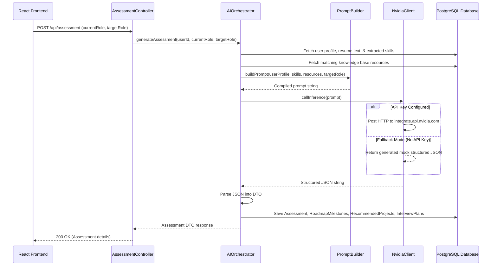

# Implementation Plan - Final Part: AI Career Intelligence Engine (Phases 4-11)

This final plan covers the integration of NVIDIA's Llama-3.3-Nemotron model to analyze user skill profiles, target roles, and our PostgreSQL knowledge-base resources to generate personalized skill gap assessments, study roadmaps, recommended projects, resources, and interview preparation guides.

## Architectural Design

### 1. The Core AI Integration Flow (Pipeline 2)

### 2. Database Changes
No schema changes. We will populate the relational tables designed in Phase 2:
- `assessments`
- `roadmap_milestones`
- `recommended_projects`
- `interview_plans`

---

## User Review Required

> [!IMPORTANT]
> **API Key Config & Fallback**: The client will read the API Key from `nvidia.api-key` in `application.properties`. If the property is empty or set to `MOCK`, the service will execute in fallback mode, generating realistic structured JSON recommendations. This prevents application crashes when running in local development without API keys.
> 
> **Resume Parsing**: We will expose `POST /api/resume/upload` to upload and scan `.txt` resumes, extract skills using matching rules, and save them.

---

## Proposed Changes

### [AI & Prompt Engineering Package]

#### [NEW] [NvidiaClient.java](file:///home/akash-sharma/React%20Project/Career%20Compass/backend/src/main/java/com/authentication/AuthProject/ai/client/NvidiaClient.java)
- Handles HTTP requests to the NVIDIA NIM API base URL (`https://integrate.api.nvidia.com/v1/chat/completions`).
- Employs RestTemplate to call `nvidia/llama-3.3-nemotron-super-49b-v1.5`.

#### [NEW] [PromptBuilder.java](file:///home/akash-sharma/React%20Project/Career%20Compass/backend/src/main/java/com/authentication/AuthProject/ai/prompt/PromptBuilder.java)
- Assembles prompt text containing:
  - System instructions.
  - User's current role and skills.
  - User's resume text context.
  - Target role.
  - Available learning resources fetched from the database.
  - Required JSON schema template.

#### [NEW] [AIOrchestrator.java](file:///home/akash-sharma/React%20Project/Career%20Compass/backend/src/main/java/com/authentication/AuthProject/ai/service/AIOrchestrator.java)
- Coordinates prompt assembly, calls `NvidiaClient`, parses the JSON string response, and orchestrates database transactions to persist the resulting entities.

### [Resume Parsing & Skill Extraction Package]

#### [NEW] [ResumeController.java](file:///home/akash-sharma/React%20Project/Career%20Compass/backend/src/main/java/com/authentication/AuthProject/resume/controller/ResumeController.java)
- Exposes `POST /api/resume/upload` to accept files, extract text content, scan for skills, and return the extracted skills.

### [Assessment & Roadmap Package]

#### [NEW] [AssessmentController.java](file:///home/akash-sharma/React%20Project/Career%20Compass/backend/src/main/java/com/authentication/AuthProject/assessment/controller/AssessmentController.java)
- Exposes `POST /api/assessment` to trigger assessment creation.
- Exposes `GET /api/assessment/latest` to retrieve latest roadmap and assessment.

#### [NEW] [AssessmentResponseDto.java](file:///home/akash-sharma/React%20Project/Career%20Compass/backend/src/main/java/com/authentication/AuthProject/assessment/dto/AssessmentResponseDto.java)
- Unifies the assessment, roadmap milestones, projects, resources, and interview plans into a single DTO matching the React frontend's schema.

### [React Frontend Integration]

#### [MODIFY] [mockAnalysis.ts](file:///home/akash-sharma/React%20Project/Career%20Compass/frontend/src/services/mockAnalysis.ts)
- Refactor the API client service to perform live HTTP requests to our backend `/api/assessment` and `/api/resume/upload` endpoints (using the user's JWT token for authorization).

#### [MODIFY] [Dashboard.tsx](file:///home/akash-sharma/React%20Project/Career%20Compass/frontend/src/pages/Dashboard.tsx)
- Fetch the latest assessment from `/api/assessment/latest` on component mount, falling back to local storage if offline.

---

## Verification Plan

### Automated Tests
- Write mock tests in `AIOrchestratorTest` checking parser correctness and database saving.
- Run `mvn test` to ensure successful compilation.

### Manual Verification
- Upload a resume file `.txt` from the frontend, verify skill extraction works, and submit the assessment form.
- Verify the E2E flow: the browser displays the generated study roadmap, recommended projects, and resources retrieved directly from the Spring Boot backend!
