# Career Compass - Frontend Infrastructure

> **Version:** 1.1  
> **Frontend:** React 19 + TypeScript + Vite 8  
> **Aesthetics:** Minimalist Charcoal & Slate Gray (Solid Colors, Zero Gradients)  
> **State Persistence:** LocalStorage-based Session & Result Caching  

---

# Table of Contents

1. Project Vision
2. Tech Stack
3. High-Level Architecture
4. Folder Structure
5. Routing Architecture
6. Component Architecture
7. Authentication Flow
8. Assessment Engine
9. Dashboard Architecture
10. AI Agent Architecture (Future Planning)
11. Data Flow
12. Services Layer
13. State Management & Schema
14. Styling System & Design Tokens
15. Future Backend Integration
16. Build Process
17. Key File Index

---

# 1. Project Vision

Career Compass is a career alignment and development platform built to help developers:

- Assess current technical skills profile.
- Identify skill gaps against industry target roles.
- Compare tech adoption curves and historical growth rates.
- Explore firm-specific tech stack architectures and interview topics.
- Generate personalized learning roadmaps accompanied by project ideas and resource links.

The current implementation acts as a backend-independent Single Page Application (SPA). Mock services mimic calculations and file parsing engines client-side, laying the foundation for a future Spring Boot API.

---

# 2. Tech Stack

| Layer / Aspect | Technology | Details / Purpose |
|---|---|---|
| **Core Framework** | React 19 | Standard React SPA rendering library |
| **Language** | TypeScript ~6.0 | Statically typed JavaScript for build-time safety |
| **Build System** | Vite 8 | Fast ESM-based bundling and HMR dev server |
| **Routing** | React Router v7 | Declarative SPA navigation and Route Guards |
| **Styling** | Tailwind CSS v3 | Utility-first styling framework |
| **Design Tokens** | CSS Variables | Solid neutral themes (white background, slate gray borders/text) |
| **Icons** | Lucide React | Clean, scalable SVG icons |
| **Lottie Player** | `@lottiefiles/dotlottie-react` | Dedicated animation component for the 404 page |
| **Charts** | Recharts v3 | Responsive charts for technology growth trends |
| **Quality Gates** | Oxlint | High-speed JavaScript/TypeScript lint validator |

---

# 3. High-Level Architecture

The block diagram below illustrates the structural relationships between the UI components, route protection middleware, logic/parsing services, local storage persistence, and the future integration path with a Spring Boot API.

<div style="width: 100%; overflow-x: auto; border: 1px solid #1e293b; border-radius: 6px; padding: 16px; background-color: #0f172a; margin-bottom: 24px;">
<div style="min-width: 1000px;">

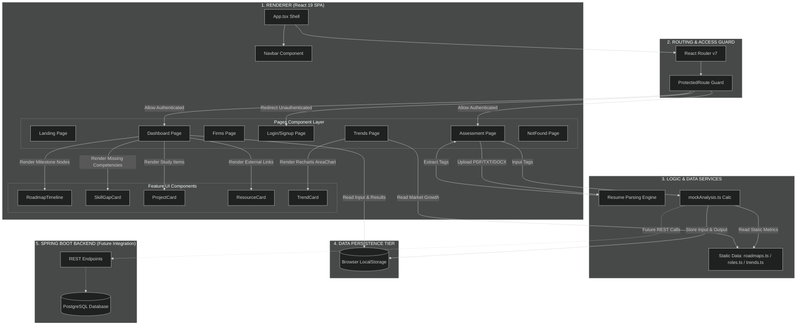

</div>
</div>

---

# 4. Folder Structure

The frontend project directories are organized inside the `frontend/src/` folder:

```text
src/
├── assets/        # Static graphic assets (like error.lottie)
├── components/    # Reusable layout and feature elements (Navbar, Cards, Timeline)
├── data/          # Static JSON databases (roles, roadmaps, trends)
├── pages/         # Primary routed SPA screens (Landing, Assessment, Dashboard, etc.)
├── services/      # Mock logic calculation files (mockAnalysis.ts)
├── types/         # Strict TypeScript domain interfaces
├── App.tsx        # Application entry shell and routing configuration
├── index.css      # Core tailwind configuration imports
└── main.tsx       # React root bootstrap file
```

<div style="width: 100%; overflow-x: auto; border: 1px solid #1e293b; border-radius: 6px; padding: 16px; background-color: #0f172a; margin-bottom: 24px;">
<div style="min-width: 1000px;">

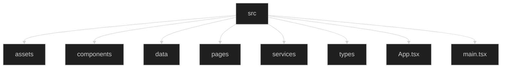

</div>
</div>

---

# 5. Routing Architecture

Every page component is managed through declarative routing inside `App.tsx`:

<div style="width: 100%; overflow-x: auto; border: 1px solid #1e293b; border-radius: 6px; padding: 16px; background-color: #0f172a; margin-bottom: 24px;">
<div style="min-width: 1000px;">

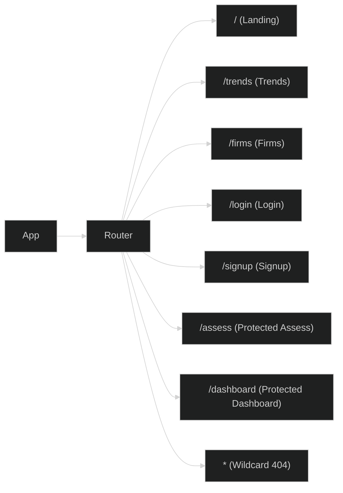

</div>
</div>

---

# 6. Component Architecture

The hierarchy diagram below illustrates how core views inherit layouts and nest sub-components:

<div style="width: 100%; overflow-x: auto; border: 1px solid #1e293b; border-radius: 6px; padding: 16px; background-color: #0f172a; margin-bottom: 24px;">
<div style="min-width: 1000px;">

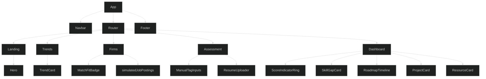

</div>
</div>

---

# 7. Authentication Flow

Authentication is managed via client-side routing guards. The `ProtectedRoute` intercepts request navigation and checks `localStorage` for the presence of an active `user_session`.

<div style="width: 100%; overflow-x: auto; border: 1px solid #1e293b; border-radius: 6px; padding: 16px; background-color: #0f172a; margin-bottom: 24px;">
<div style="min-width: 1000px;">

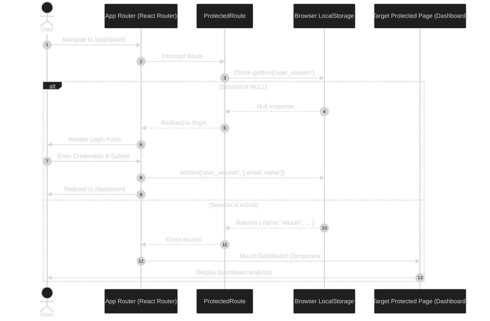

</div>
</div>

---

# 8. Assessment Engine

The Assessment page allows the compilation of skills either manually or by scanning uploaded files.

<div style="width: 100%; overflow-x: auto; border: 1px solid #1e293b; border-radius: 6px; padding: 16px; background-color: #0f172a; margin-bottom: 24px;">
<div style="min-width: 1000px;">

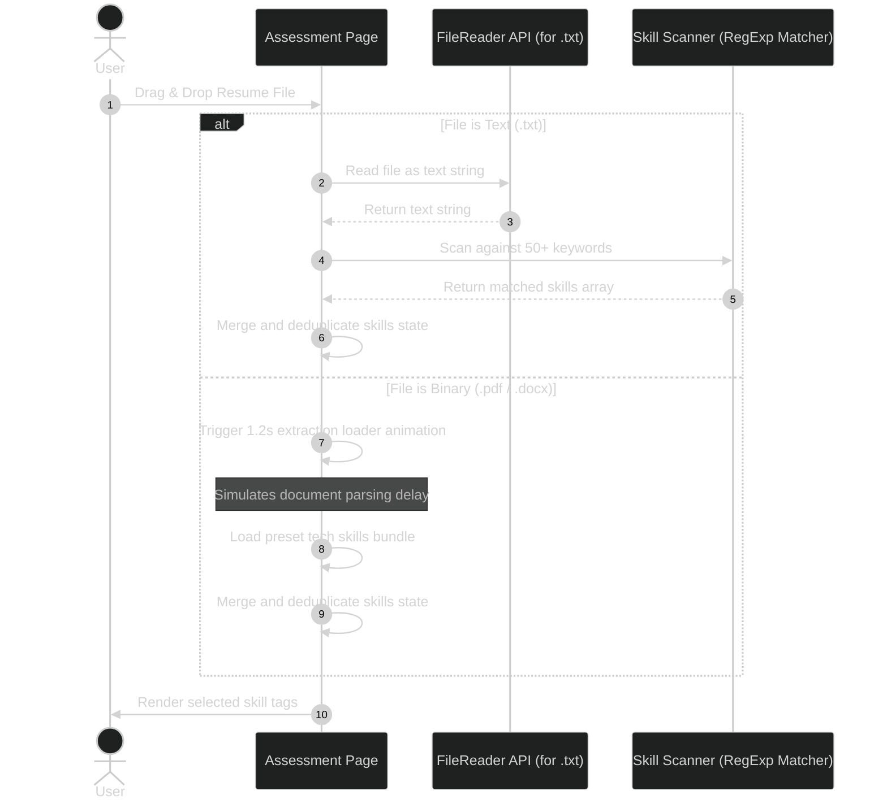

</div>
</div>

---

# 9. Dashboard Architecture

The Dashboard parses the saved calculation results to feed visual dashboard segments, supporting interactive checklist status tracking for roadmaps, projects, and resources:

*   **Status Tracking Persistence**:
    *   Roadmap topics are tracked via `localStorage` key `cc_completed_topics`.
    *   Recommended projects are tracked via `localStorage` key `cc_completed_projects`.
    *   Learning resources are tracked via `localStorage` key `cc_completed_resources`.
*   **Visual Completion State**: Completed cards render with emerald borders and line-through titles to distinguish them from active tasks.

<div style="width: 100%; overflow-x: auto; border: 1px solid #1e293b; border-radius: 6px; padding: 16px; background-color: #0f172a; margin-bottom: 24px;">
<div style="min-width: 1000px;">

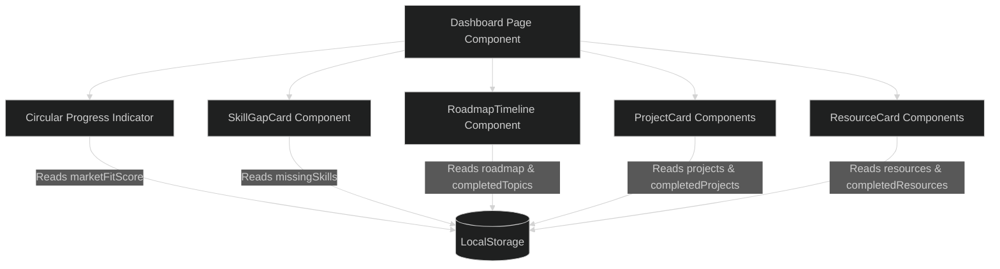

</div>
</div>

---

# 10. AI Agent Recommendations System

The dashboard implements a weekly AI Agent Recommendations interface simulating background analysis of industry trends and hiring requirements:

*   **Role-Targeted Suggestions**: Checks the user's `targetRole` to fetch high-value suggestions (e.g. Model Context Protocol for Frontend, LangGraph for AI/ML).
*   **Curriculum updates (Roadmap)**: Appends the suggested topic to the roadmap month inside `localStorage` under `cc_assessment_result`.
*   **Learning Resources updates**: Appends the suggested guide/book card to the educational resources array under `cc_assessment_result`.
*   **Actionable Undo / Revert States**: Allows users to revert applied recommendations. Reverting a suggestion removes the topic or resource card and automatically resets checklist progress for that topic or resource if the user had checked it.

<div style="width: 100%; overflow-x: auto; border: 1px solid #1e293b; border-radius: 6px; padding: 16px; background-color: #0f172a; margin-bottom: 24px;">
<div style="min-width: 1000px;">

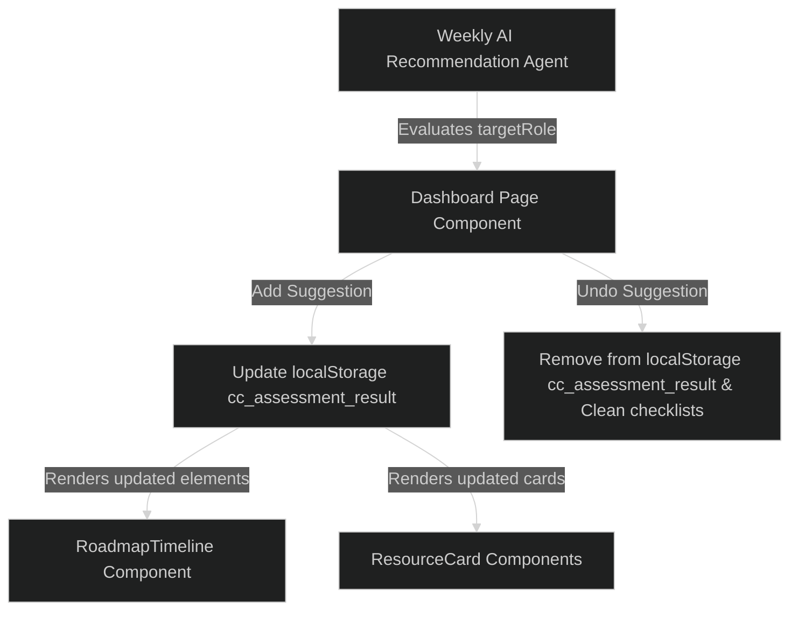

</div>
</div>

---

# 11. Data Flow

The following sequence illustrates how data flows from user actions down to mock local files:

<div style="width: 100%; overflow-x: auto; border: 1px solid #1e293b; border-radius: 6px; padding: 16px; background-color: #0f172a; margin-bottom: 24px;">
<div style="min-width: 1000px;">

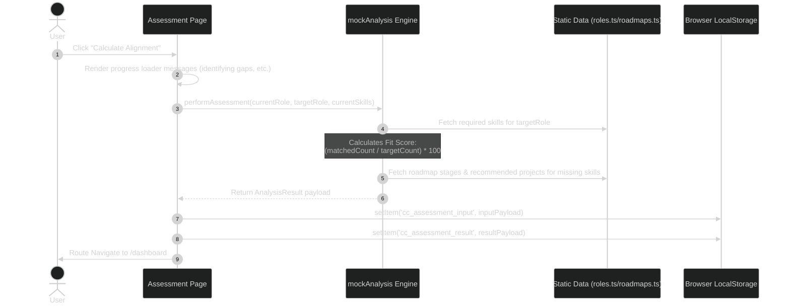

</div>
</div>

---

# 12. Services Layer

The mock services layer decouples page rendering from calculations:

<div style="width: 100%; overflow-x: auto; border: 1px solid #1e293b; border-radius: 6px; padding: 16px; background-color: #0f172a; margin-bottom: 24px;">
<div style="min-width: 1000px;">

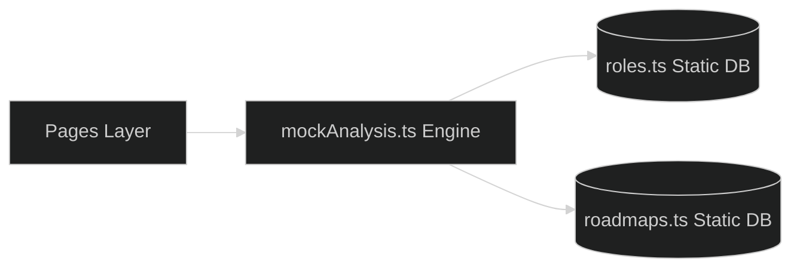

</div>
</div>

---

# 13. State Management & Schema

The application does not use external state stores (like Redux or Zustand). Instead, persistent state is written to `localStorage`.

### **13.1 `user_session`**
```json
{
  "email": "akash@example.com",
  "name": "Akash"
}
```

### **13.2 `cc_assessment_input`**
```json
{
  "currentRole": "Junior Frontend Developer",
  "targetRole": "frontend-senior",
  "currentSkills": ["React", "TypeScript", "Git", "HTML5", "CSS3"]
}
```

### **13.3 `cc_assessment_result`**
```json
{
  "roleId": "frontend-senior",
  "roleName": "Senior Frontend Developer",
  "marketFitScore": 62,
  "matchedSkills": ["React", "TypeScript", "HTML5", "CSS3"],
  "missingSkills": ["Next.js", "Redux", "Webpack", "Vite", "Jest"],
  "roadmap": [
    {
      "month": "Month 1",
      "topic": "Vite & Performance Optimisation",
      "description": "Transition from CRA, setup modular bundle splitting..."
    }
  ],
  "projects": [
    {
      "title": "Module Bundler Setup",
      "description": "Configure a complex build setup using Vite and Webpack."
    }
  ],
  "resources": [
    {
      "title": "Vite Documentation",
      "url": "https://vite.dev",
      "type": "documentation"
    }
  ]
}
```

---

# 14. Styling System & Design Tokens

Styles follow a flat, clean minimalist layout. Colors are solid neutrals:

*   `background`: `#ffffff` (Solid White background)
*   `surface`: `#f8fafc` (Light Slate off-white surface)
*   `border`: `#e2e8f0` (Light gray border)
*   `primary`: `#0f172a` (Charcoal primary accents)
*   `text`: `#334155` (Slate gray body text)

All custom elements (borders, inputs, buttons) use flat `#e2e8f0` outlines, avoiding large gradients or decorative drop shadows.

---

# 15. Future Spring Boot Integration

When migrating from localStorage, API calls will route through Axios or fetch wrappers straight to the Java REST controllers.

<div style="width: 100%; overflow-x: auto; border: 1px solid #1e293b; border-radius: 6px; padding: 16px; background-color: #0f172a; margin-bottom: 24px;">
<div style="min-width: 1000px;">

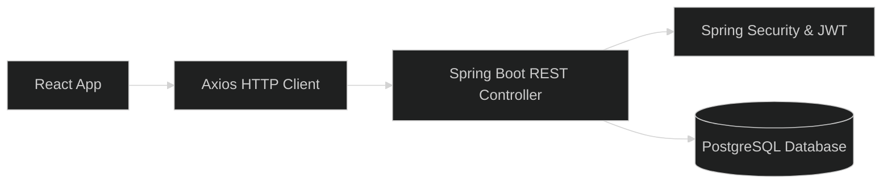

</div>
</div>

---

# 16. Build Process

Vite coordinates code bundling, transpiling TSX nodes down to static HTML, CSS, and JS chunks:

<div style="width: 100%; overflow-x: auto; border: 1px solid #1e293b; border-radius: 6px; padding: 16px; background-color: #0f172a; margin-bottom: 24px;">
<div style="min-width: 1000px;">

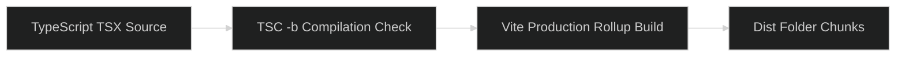

</div>
</div>

---

# 17. Key File Index

| Directory / Module | Key File Path | Purpose |
|---|---|---|
| **Routing / Protected Rules** | `src/App.tsx` | Route mapping and session guard checks |
| **Entrypoint Bootstrap** | `src/main.tsx` | App bootstrapper rendering DOM root |
| **Global Typography Styles** | `src/index.css` | Base Tailwind directive definitions |
| **Theme Design Tokens** | `tailwind.config.js` | Palette mapping for neutral slate styling |
| **Assessment Page** | `src/pages/Assessment.tsx` | Resume parsing, file ingestion, tag layout |
| **Report Dashboard** | `src/pages/Dashboard.tsx` | Study timelines, gaps grid, match fit percentage |
| **Company Insights** | `src/pages/CompanyTrends.tsx` | Firm-specific tech stacks, interview focus areas |
| **Market Growth Charts** | `src/pages/Trends.tsx` | Cumulative growth, charts, tech analysis |
| **Calculation Engine** | `src/services/mockAnalysis.ts` | Match math calculations, roadmaps mappings |
