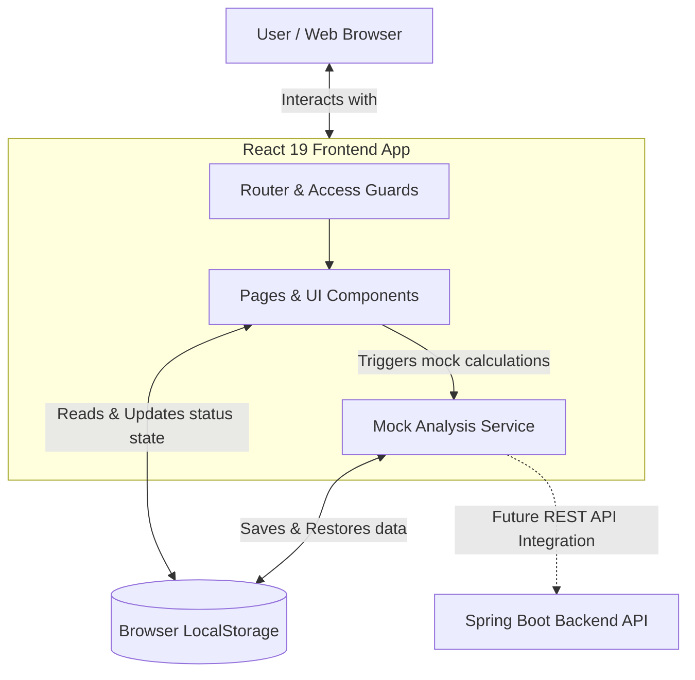
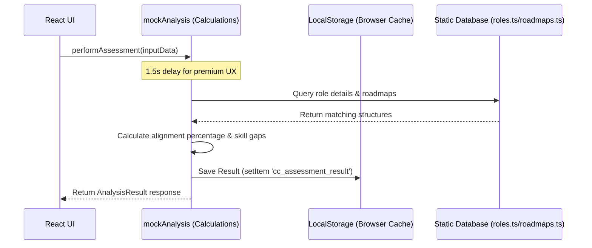
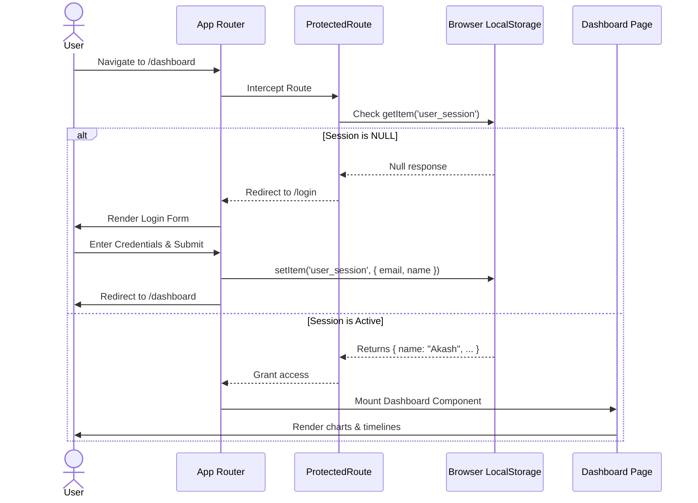
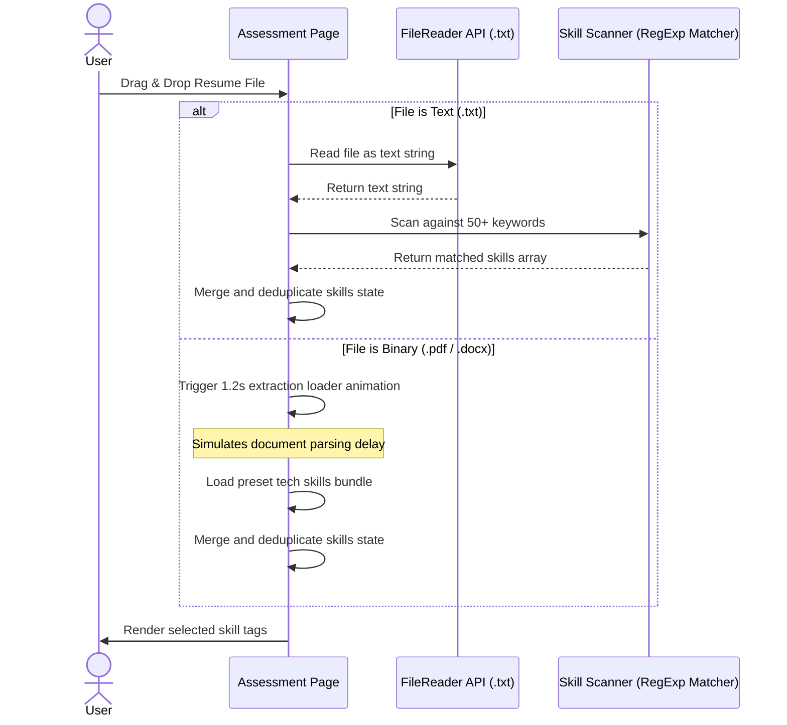
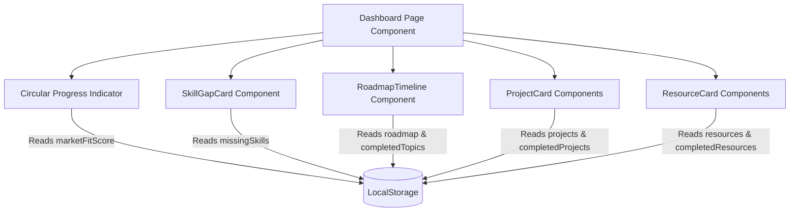
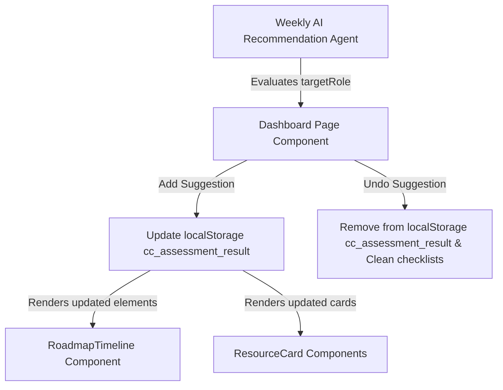

## **Career Compass - Frontend Infrastructure**

## **Table of contents**

1. `o` 1. What Career Compass Is `o` 2. Tech Stack - What We Use `o` 3. Process Model - The Big Picture `o` 4. Renderer Architecture `o` 5. Data Flow - End to End `o` 6. Domain Model `o` 7. Types & Schemas `o` 8. Local Persistence (LocalStorage) `o` 9. Security Infrastructure `o` 10. Configuration `o` 11. Build, Scripts & Quality Gates `o` 12. Deployment & Future Integration `o` 13. Key File Index

## **1. What Career Compass Is**

Career Compass is a **career development and assessment Single Page Application (SPA)** built with React 19, TypeScript, and Vite. The application is designed to map a developer's current skillset against target career roles, calculate technical gap alignments, and generate customized month-by-month learning roadmaps accompanied by project recommendations and curated resources.

The project currently lives under the `frontend/` subdirectory, preparing it to easily interface with a future Spring Boot backend.

**The single most important architectural rule:** The frontend is backend-independent. All authentication flows, skill gap assessments, and roadmap calculations are mock-simulated client-side and persisted in browser `localStorage`. This ensures that state remains consistent across route changes, navigation, and page refreshes.

## **2. Tech Stack - What We Use**

**Layer / Aspect** | **Technology** | **Details / Purpose**
---|---|---
**Core SPA framework** | React 19 | Standard React SPA rendering library
**Language** | TypeScript ~6.0 | Statically typed JavaScript for build-time safety
**Build system** | Vite 8 | Fast ESM-based bundling and HMR dev server
**Routing** | React Router v7 | Declarative SPA navigation and Route Guards
**Styling** | Tailwind CSS v3 | Utility-first utility framework for layout and spacing
**Design tokens** | CSS Variables | Custom neutral variables (`#ffffff` background, slate gray borders/text)
**Icons** | Lucide React | Modular SVG icons
**Lottie player** | `@lottiefiles/dotlottie-react` | Dedicated animation component for the 404 page
**Charts** | Recharts v3 | Responsive charting engine for technology growth trends
**Quality gates** | Oxlint | High-speed JavaScript/TypeScript lint validator
**State management** | React state & storage | React Context + hooks (no Redux/Zustand/MobX)
**Persistence** | LocalStorage API | Browser caching for session and report persistence

## **3. Process Model - The Big Picture**

Career Compass operates in a highly modular, decoupled environment. Since there is currently no live backend, the application encapsulates its own logic engine (`mockAnalysis.ts`) to simulate remote processing.

## **3.1 High-level architecture**

The block diagram below illustrates the structural relationships between the UI components, route protection middleware, logic/parsing services, local storage persistence, and the future integration path with a Spring Boot API.

```mermaid
graph TD
    User[User / Web Browser] <-->|Interacts with| ReactSPA[React SPA Frontend]
    
    subgraph ReactSPA [React 19 Frontend App]
        Router[Router & Access Guards] --> Pages[Pages & UI Components]
        Pages -->|Triggers mock calculations| MockService[Mock Analysis Service]
    end
    
    MockService <-->|Saves & Restores data| LS[(Browser LocalStorage)]
    Pages <-->|Reads & Updates status state| LS
    
    MockService -.->|Future REST API Integration| SpringBoot[Spring Boot Backend API]
```

## **3.2 Mock Process (services/mockAnalysis.ts)**

The calculation engine functions as a local service, mimicking backend processing. It implements a 1.5-second network delay to test loading animations and spinner states, calculating compatibility percentages and matching skill gaps dynamically against static role specifications.

## **3.3 Service Gateway Layer**

A thin wrapper pattern is utilized to isolate calculations and static data imports from React rendering pages. Data fetching services mimic asynchronous REST communication using Promise wrappers:

*   `performAssessment()` takes user profiles, compares tags, and outputs milestones, projects, and resources.
*   `skillInsights.ts` serves trending capabilities dynamically based on the active role selection.

## **3.4 Mock Request Flow**

The flowchart below traces a simulation request:

```mermaid
sequenceDiagram
    participant Renderer as React UI
    participant Service as mockAnalysis (Calculations)
    participant LS as LocalStorage (Browser Cache)
    participant StaticData as Static Database (roles.ts/roadmaps.ts)
    
    Renderer->>Service: performAssessment(inputData)
    Note over Service: 1.5s delay for premium UX
    Service->>StaticData: Query role details & roadmaps
    StaticData-->>Service: Return matching structures
    Service->>Service: Calculate alignment percentage & skill gaps
    Service->>LS: Save Result (setItem 'cc_assessment_result')
    Service-->>Renderer: Return AnalysisResult response
```

## **3.5 Renderer (src/)**

The React 19 SPA entry point is `src/main.tsx` which boots the root node and mounts `<App />` within the browser DOM.

## **4. Renderer Architecture**

## **4.1 App shell & provider tree**

`App.tsx` serves as the primary layout wrapper. It imports the global styling sheet, initializes routing configurations via `react-router-dom`, wraps the interface with a shared `<Navbar />` header and `<footer />`, and applies `ProtectedRoute` gates to secure authenticated views.

## **4.2 Auth gate flow**

Navigation security relies on the client-side session guard check:

```mermaid
sequenceDiagram
    actor User
    participant Router as App Router
    participant Guard as ProtectedRoute
    participant LS as Browser LocalStorage
    participant Page as Dashboard Page
    
    User->>Router: Navigate to /dashboard
    Router->>Guard: Intercept Route
    Guard->>LS: Check getItem('user_session')
    alt Session is NULL
        LS-->>Guard: Null response
        Guard-->>Router: Redirect to /login
        Router->>User: Render Login Form
        User->>Router: Enter Credentials & Submit
        Router->>LS: setItem('user_session', { email, name })
        Router->>User: Redirect to /dashboard
    else Session is Active
        LS-->>Guard: Returns { name: "Akash", ... }
        Guard-->>Router: Grant access
        Router->>Page: Mount Dashboard Component
        Page->>User: Render charts & timelines
    end
```

## **4.3 Navigation & Routing**

Declarative routing is handled via `react-router-dom`:

*   **Public Routes:** `/` (Landing Page), `/trends` (Trends Page), `/firms` (Company Trends Page), `/login` (Login Page), `/signup` (Signup Page), `*` (Wildcard NotFound).
*   **Protected Routes:** `/assess` (Assessment Page), `/dashboard` (Dashboard Page).

Unauthenticated user access triggers instant redirects to `/login`.

## **4.4 Feature Components & Panels Stack UX**

*   **Tabs Layout:** Assessment page allows switching between Manual Tag Inputs and Resume File Upload components.
*   **Weekly Suggestions Flyout:** Dashboard page hosts a right-side sliding panel overlay for the AI Recommendation Agent, featuring action buttons to add or revert suggestions, and applying blur-backdrops.
*   **Progress Indicators:** Circular matching progress rings use dynamic SVG properties to paint score completion curves.

## **4.5 Pages (src/pages/)**

**Page** | **Role**
---|---
`Landing.tsx` | High-impact marketing gateway introducing platform features and actions.
`Trends.tsx` | Analytical metrics platform with search, sortable tables, and Recharts AreaChart.
`CompanyTrends.tsx` | Firm-specific stacks, target role matching scores, open positions list, and simulated application logic.
`Assessment.tsx` | Input panel supporting manual skill entry and resume parser scanners.
`Dashboard.tsx` | Main user panel tracking milestone roadmaps, gaps breakdowns, and project checklists.
`Login.tsx` / `Signup.tsx` | Minimalist credentials portals simulating user profile setups.
`NotFound.tsx` | Wildcard landing screen centering on Lottie error animations.

## **4.6 Component organization (src/components/)**

**Folder / File** | **Contents**
---|---
`Navbar.tsx` | Global header control representing links and user session greetings.
`Hero.tsx` | Core CTA block presenting landing summaries.
`RoadmapTimeline.tsx` | Month-by-month interactive study checklists.
`SkillGapCard.tsx` | Badge widgets representing core target omissions.
`ProjectCard.tsx` | Interactive card tracking portfolio building progress.
`ResourceCard.tsx` | Curated tutorial links with checkable completions.
`TrendCard.tsx` | Flat container components hosting Recharts components.
`TrendingSkillInsightCard.tsx` | Component mapping top-growth capabilities and target companies.

## **4.7 State management**

No external store is implemented. Domain states leverage:

*   **React State Hooks:** Managing local active selections, loaders, and checklists state variables.
*   **Browser Caches:** Event handlers synchronize state variables directly with browser cache stores on user interaction.

## **4.8 Styling & theme**

*   **Tailwind CSS:** Integrated at root through Vite directives in `index.css`.
*   **Theme Tokens:** Configured within `tailwind.config.js` to map solid, charcoal, and slate gray tones:
    *   `background`: `#ffffff` (Solid white base)
    *   `surface`: `#f8fafc` (Slate light tint)
    *   `border`: `#e2e8f0` (Flat divider gray)
    *   `primary`: `#0f172a` (Charcoal theme colors)
    *   `text`: `#334155` (Slate body text)

## **4.9 Hooks (src/hooks/)**

Custom hook files are not utilized in the current lightweight implementation. Standard hooks (`useState`, `useEffect`) manage states directly inside pages.

## **4.10 Forms & validation**

*   **Manual Entries:** Validates duplicates and empty states on Enter or Add clicks.
*   **Resume Uploader:** Uses native `FileReader` to read text formats, comparing lines against a database of 50+ known technology terms. Preset skill profiles map standard sets for binary formats.

## **5. Data Flow - End to End**

**Mental model:** Browser `localStorage` serves as the frontend client's local database. The calculation engine acts as the service coordinator, compiling result states and writing back to browser cache keys.

## **5.1 Assessment Data Flow**

The flowchart below traces the skill assessment data routing:

```mermaid
sequenceDiagram
    actor User
    participant Page as Assessment Page
    participant Reader as FileReader API (.txt)
    participant Engine as Skill Scanner (RegExp Matcher)
    
    User->>Page: Drag & Drop Resume File
    alt File is Text (.txt)
        Page->>Reader: Read file as text string
        Reader-->>Page: Return text string
        Page->>Engine: Scan against 50+ keywords
        Engine-->>Page: Return matched skills array
        Page->>Page: Merge and deduplicate skills state
    else File is Binary (.pdf / .docx)
        Page->>Page: Trigger 1.2s extraction loader animation
        Note over Page: Simulates document parsing delay
        Page->>Page: Load preset tech skills bundle
        Page->>Page: Merge and deduplicate skills state
    end
    Page->>User: Render selected skill tags
```

## **5.2 Assessment Calculation**

Upon clicking "Calculate Alignment", inputs route through `performAssessment()`, fetching matching roles from the static roles configuration, computing matching scores, filtering missing elements into priority gaps, and appending month-by-month stages.

## **5.3 Renderer -> Backend Call Patterns**

*   **Calculation Requests:** Routes via the async Promise interface to the mock analysis engine.
*   **State Restorations:** Component mounts query `localStorage.getItem()` parameters, parsing strings into component states.
*   **State Updates:** Interactive checkboxes invoke `localStorage.setItem()` events to sync completed nodes.

## **5.4 Why the renderer can't make HTTP**

Since Career Compass is a client-independent frontend prototype, direct HTTP calls to external APIs are prohibited to maintain isolation. In future iterations, HTTP requests will route through dedicated api clients.

## **5.5 Real-Time Sync / Updates**

Checking milestone roadmaps, projects, or study resources synchronizes with local storage. Checklist totals dynamically recalculate completion percentages:

```mermaid
graph TD
    DashboardPage[Dashboard Page Component]
    DashboardPage --> circularRing[Circular Progress Indicator]
    DashboardPage --> gapsCard[SkillGapCard Component]
    DashboardPage --> timelineNode[RoadmapTimeline Component]
    DashboardPage --> projCard[ProjectCard Components]
    DashboardPage --> resCard[ResourceCard Components]
    
    circularRing -->|Reads marketFitScore| localDB[(LocalStorage)]
    gapsCard -->|Reads missingSkills| localDB
    timelineNode -->|Reads roadmap & completedTopics| localDB
    projCard -->|Reads projects & completedProjects| localDB
    resCard -->|Reads resources & completedResources| localDB
```

## **5.6 AI recommendations flow**

The AI Agent Recommendations System evaluates target roles to prompt weekly updates:

```mermaid
graph TD
    AIAgent[Weekly AI Recommendation Agent] -->|Evaluates targetRole| DashboardPage[Dashboard Page Component]
    DashboardPage -->|Add Suggestion| applyAction[Update localStorage cc_assessment_result]
    DashboardPage -->|Undo Suggestion| revertAction[Remove from localStorage cc_assessment_result & Clean checklists]
    applyAction -->|Renders updated elements| RoadmapTimeline[RoadmapTimeline Component]
    applyAction -->|Renders updated cards| ResourceCard[ResourceCard Components]
```

## **5.7 Auth flow (localStorage Session)**

Session simulation writes name and email into `user_session`. Navigation guards verify these parameters on transition.

## **6. Domain Model**

## **6.1 Core entities**

**Entity** | **Description**
---|---
`CareerRole` | Static role profile defining required technical stack skills (e.g. `frontend`).
`AssessmentData` | Struct containing user selections (`currentRole`, `targetRole`, and string `currentSkills`).
`AnalysisResult` | Processed outcome detailing compatibility score, missing gaps, and milestones roadmap.
`RoadmapItem` | Month-by-month sequential block detailing learning stages.
`RecommendedProject` | Practice exercises mapped to identified gaps.
`LearningResource` | Handpicked reference guides to cover core gaps.

## **6.2 Manual vs Resume Upload vs AI suggested**

**Aspect** | **Manual Entry** | **Resume Upload** | **AI Suggested**
---|---|---|---
**Source** | User typing tags | Text parser / preset bundle | Recommendation flyout panel
**Keys** | `cc_assessment_input` | `cc_assessment_input` | `cc_applied_recommendations`
**Recalculation** | Re-run assessment | Re-run assessment | Inline state patch & undo capability

## **7. Types & Schemas**

Type definition locations:

*   **Domain Models (`src/types/index.ts`):** `TrendChartPoint`, `TechTrend`, `CareerRole`, `RoadmapItem`, `RecommendedProject`, `LearningResource`, `SkillGap`, `AssessmentData`, `AnalysisResult`, `TrendingSkillInsight`.
*   **Asset Declarations (`src/types/lottie.d.ts`):** Imports `.lottie` files as asset structures.

## **8. Local Persistence (LocalStorage)**

All data states persist within the browser's `localStorage` to simulate backend storage:

*   `user_session`: `{ email: string, name: string }`
*   `cc_assessment_input`: `{ currentRole: string, targetRole: string, currentSkills: string[] }`
*   `cc_assessment_result`: `{ marketFitScore: number, missingSkills: SkillGap[], trendingSkills: string[], roadmap: RoadmapItem[], projects: RecommendedProject[], resources: LearningResource[] }`
*   `cc_completed_topics`: Array of completed topics keys (`["Month 1 - Vite Setup"]`)
*   `cc_completed_projects`: Array of completed project titles (`["Module Bundler Setup"]`)
*   `cc_completed_resources`: Array of completed resource names (`["Vite Documentation"]`)
*   `cc_applied_recommendations`: Array of applied AI recommendation IDs (`["rec-fe-roadmap"]`)

## **9. Security Infrastructure**

*   **Routing Security:** `ProtectedRoute` intercepts hits to `/assess` and `/dashboard`, checking local session states.
*   **Redirect rules:** Unauthorized visitors route directly to `/login`, preserving URL history.
*   **Mock Session Separation:** Logouts clear all browser `localStorage` parameters instantly, forcing component restarts.

## **10. Configuration**

**File** | **Role**
---|---
`tailwind.config.js` | Design tokens, extending solid neutral tones (`#ffffff` background, `#f8fafc` surface).
`vite.config.ts` | React plugin config, absolute path aliases (`@/`), and port configuration.
`tsconfig.app.json` | Strict typings, enforcing `verbatimModuleSyntax` and flagging unused locals.

## **11. Build, Scripts & Quality Gates**

Quality control and build pipelines are defined via npm scripts in `package.json`:

*   `npm run dev`: Runs Vite dev server.
*   `npm run build`: Compiles TypeScript files and builds the optimized static bundle.
*   `npm run lint`: Executes validation check via **Oxlint**.
*   `npm run preview`: Launches a local server previewing the static build folder.

## **12. Deployment & Future Integration**

*   **Deployment:** The SPA is optimized for static hosting engines (Vite output compiles to pure static HTML/CSS/JS in the `dist` folder).
*   **Future Backend API:** Transitioning from `localStorage` to a Spring Boot API will involve substituting local storage queries with Axios/Fetch endpoints routing requests directly to REST controllers.

## **13. Key File Index**

**Concern** | **Path**
---|---
Renderer Entry / Shell | `src/main.tsx`, `src/App.tsx`
Layout Navigation | `src/components/Navbar.tsx`
Feature Pages | `src/pages/Assessment.tsx`, `src/pages/Dashboard.tsx`, `src/pages/Trends.tsx`, `src/pages/CompanyTrends.tsx`
Logic Engine | `src/services/mockAnalysis.ts`
Static Data | `src/data/roles.ts`, `src/data/roadmaps.ts`, `src/data/trends.ts`, `src/data/skillInsights.ts`
Domain Types | `src/types/index.ts`
Theme / Config | `tailwind.config.js`, `vite.config.ts`
